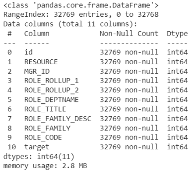
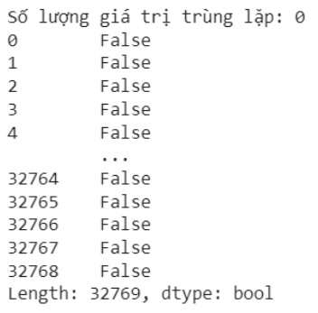
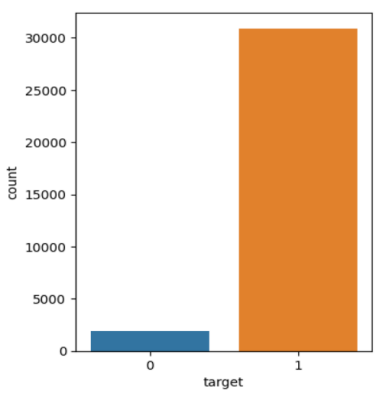
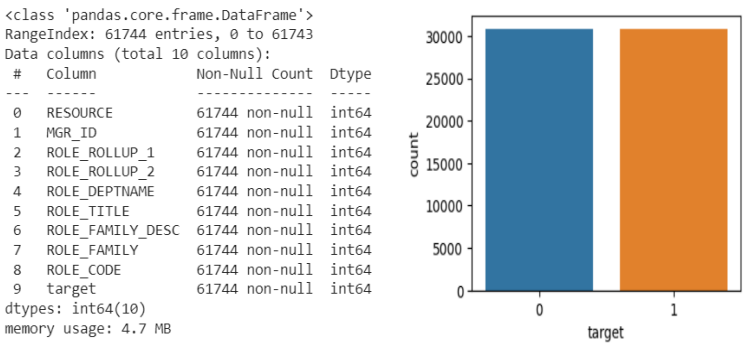
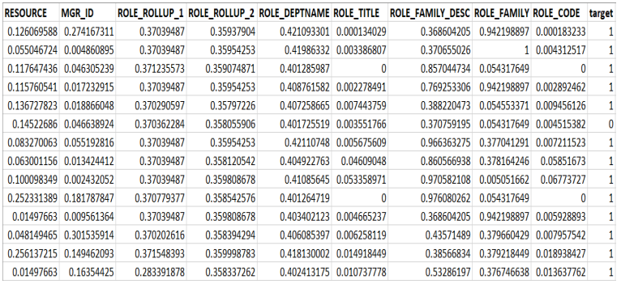
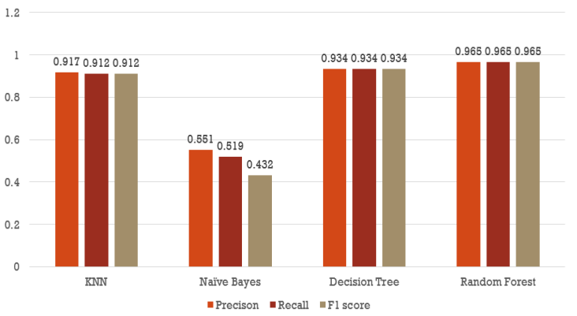
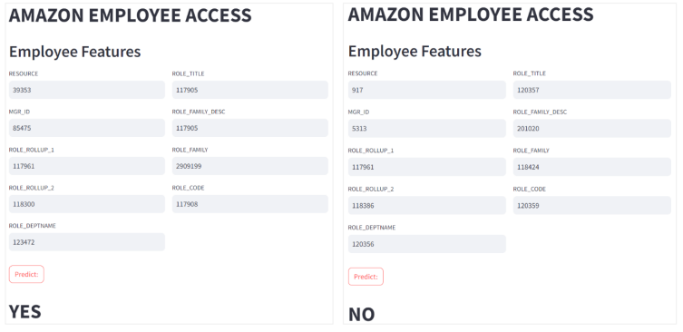

# Xây dựng mô hình máy học dự đoán quyền truy cập tài nguyên của nhân viên công ty Amazon

Source dataset: https://www.openml.org/search?type=data&status=active&id=4135

## Tổng quan về dataset

Dataset không có hơn 32 nghìn dòng, 11 cột. Cột id không được dùng để huấn luyện mô hình do cột id là số thứ tự => không có mối tương quan với các thuộc tính khác, còn lại 9 cột đặt trưng, 1 cột nhãn (cột **target**)

Dataset không có ô trống, kiểu dữ liệu của tất cả các cột là kiểu **int**



Dataset không có các mẫu bị trùng lặp giá trị
```python
df.duplicates()
```



Kiểm tra dữ liệu có hiện tượng mất cân bằng số lượng mẫu giữa các lớp



## Tiền xử lý dữ liệu

Mất cân bằng dữ liệu có thể dẫn đến các vấn đề như hiệu suất kém trên
lớp thiểu số hoặc phương sai mô hình cao => Sử dụng phương pháp SMOTE để
**cân bằng lại dữ liệu.**

SMOTE (Synthetic Minority Over-sampling Technique) là một phương
pháp oversampling (tăng cường) dữ liệu được sử dụng để cân bằng mẫu giữa các lớp trong bài toán phân loại, đặc biệt là khi dữ liệu là mất cân bằng (imbalanced). SMOTE tạo ra các mẫu nhân tạo cho lớp thiểu số bằng cách kết hợp thông tin từ các mẫu hiện có của lớp đó. Điều này có thể giúp mô hình học tốt hơn trên lớp thiểu số và cải thiện hiệu suất của mô hình trong tình huống mất cân bằng.



**Chuẩn hóa dữ liệu:** sử dụng phương pháp Min Max Scaling



## Kết quả huấn luyện mô hình



## Triển khai mô hình

Thư viện streamlit: Streamlit là một thư viện Python mã nguồn mở được sử
dụng để tạo các ứng dụng web tương tác một cách nhanh chóng và dễ dàng. Thư viện này cung cấp một bộ công cụ GUI mạnh mẽ cho phép các nhà khoa học dữ liệu, nhà phân tích dữ liệu và nhà phát triển web tạo các ứng dụng web đẹp mắt và hiệu quả chỉ với một vài dòng mã.

